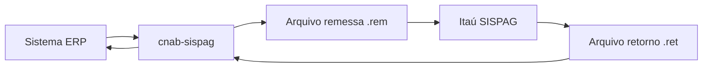

# Guia de integração

Fluxo recomendado para integrar a biblioteca em um sistema de pagamentos.

## Visão geral



## 1. Cadastro no banco

Antes de enviar arquivos em produção:

1. Contratar o produto **SISPAG Itaú** com seu gerente de relacionamento.
2. Informar as formas de pagamento que serão utilizadas (TED, PIX, boletos, tributos etc.).
3. Solicitar homologação (ver [homologation-itau.md](./homologation-itau.md)).
4. Obter agência, conta e convênio para débito.

## 2. Montar pagamentos

Cada modalidade possui um DTO específico. Consulte os guias em [payment-types/](./payment-types/pix-key.md).

| Modalidade | DTO | Forma |
|---|---|---|
| PIX chave | `PixKeyPaymentDto` | 45 |
| PIX QR Code | `PixQrCodePaymentDto` | 47 |
| Boleto | `BankSlipPaymentDto` | 30 / 31 |
| TED / DOC / crédito | `TransferPaymentDto` | 3–7, 41, 43 |
| Concessionária | `UtilityPaymentDto` | 13 |
| Tributo c/ barras (segmento O) | `UtilityPaymentDto` | 16 |
| Tributo s/ barras (segmento N) | `TaxPaymentDto` | 16, 17, 18, 22, 35 |

> A forma **16** com segmento **O** é tributo com código de barras (`BarcodeTax`). A mesma forma **16** com segmento **N** é DARF normal (`DarfNormal`). A biblioteca distingue pelo `PaymentMethod` escolhido no DTO.

## 3. Gerar remessa

```php
$files = $sispag->generateRemittance(
    company: $company,
    debitAccount: $debitAccount,
    payments: $payments,
    paymentType: PaymentType::Suppliers,
    generatedAt: new DateTimeImmutable(),
);
```

A função retorna **um ou mais arquivos**:

- Pagamentos somente PIX → 1 arquivo (`isPix = true`)
- Pagamentos somente não-PIX → 1 arquivo (`isPix = false`)
- Pagamentos mistos → 2 arquivos (PIX e não-PIX separados automaticamente)

Salve cada arquivo com o nome sugerido:

```php
foreach ($files as $file) {
    Storage::put($file->suggestedFilename, $file->content);
}
```

## 4. Validar antes de enviar

Sempre valide o arquivo gerado (ou recebido de terceiros) antes de transmitir:

```php
$result = $sispag->validateLayout($content);

if (!$result->isValid()) {
    Log::error('Arquivo CNAB inválido', ['violations' => $result->messages()]);
    throw new RuntimeException('Arquivo rejeitado na validação interna');
}
```

## 5. Transmitir ao banco

A transmissão do arquivo ao Itaú fica a cargo do seu middleware (SFTP, VAN, internet banking corporativo). A biblioteca **não** faz upload.

Recomendações:

- Enviar no horário comercial conforme contrato.
- Manter log do hash SHA-256 do arquivo enviado.
- Não reutilizar `companyDocumentNumber` para pagamentos distintos no mesmo dia.

## 6. Processar retorno

Quando o banco disponibilizar o arquivo retorno:

```php
use CnabSispag\Domain\Shared\Enum\PaymentStatus;

$content = file_get_contents('retorno.ret');
$returnFile = $sispag->parseReturn($content);

foreach ($returnFile->batches as $batch) {
    foreach ($batch->details as $detail) {
        match ($detail->status) {
            PaymentStatus::Paid => $this->markAsPaid($detail->companyDocumentNumber),
            PaymentStatus::Accepted => $this->markAsScheduled($detail->companyDocumentNumber),
            PaymentStatus::Rejected => $this->markAsRejected($detail),
            PaymentStatus::Cancelled => $this->markAsCancelled($detail),
            default => $this->markAsPending($detail),
        };
    }
}
```

Campos úteis em `ReturnDetail`:

| Campo | Descrição |
|---|---|
| `companyDocumentNumber` | Seu número (campo "Seu Número") |
| `bankDocumentNumber` | Nosso número do banco |
| `status` | `paid`, `accepted`, `rejected`, `cancelled`, `unknown` |
| `occurrences` | Códigos e descrições da Nota 8 |
| `authentication` | Autenticação eletrônica (segmento Z) |
| `parsedTaxData` | Dados estruturados de tributo (segmento N) |

## 7. Tratar exceções

A geração de remessa lança exceções tipadas quando regras de negócio são violadas:

| Exceção | Quando |
|---|---|
| `InvalidBatchException` | Lote heterogêneo, segmento proibido no perfil |
| `InvalidPaymentException` | Segmentos faltando ou ordem incorreta |
| `MixedPixFileException` | PIX e não-PIX no mesmo arquivo — lançada por `PixFileSeparator::assertSingleFileKind()` ao montar lotes manualmente; **não ocorre** em `generateRemittance()`, que separa automaticamente |
| `InvalidLayoutException` | Arquivo retorno malformado (no parser) |

Todas estendem `DomainException` com `errorCode()` em inglês e `getMessage()` em português.

## 8. Boas práticas

- **Idempotência:** associe `companyDocumentNumber` ao ID interno do pagamento.
- **Validação dupla:** valide na geração e antes do envio ao banco.
- **Encoding:** arquivos gerados já saem em Windows-1252 com CRLF; não converta para UTF-8 antes de enviar.
- **Testes:** use os testes de integração do repositório como referência de arquivos válidos.
- **Homologação:** complete os 30 arquivos-hora exigidos pelo Itaú antes de produção.

## Referência rápida da API

```php
$sispag = new ItauSispag();

// Remessa → list<GeneratedRemittanceFile>
$files = $sispag->generateRemittance($company, $debitAccount, $payments, $paymentType);

// Retorno → ReturnFile
$return = $sispag->parseReturn($content);

// Validação → ValidationResult
$result = $sispag->validateLayout($content);
```
