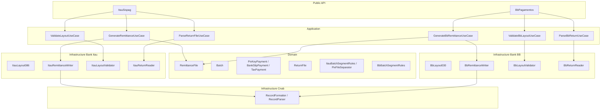
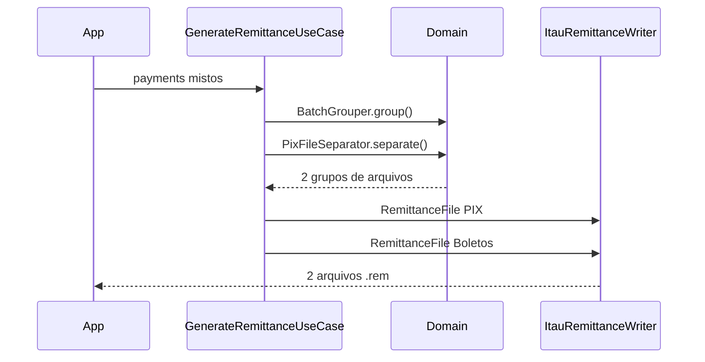
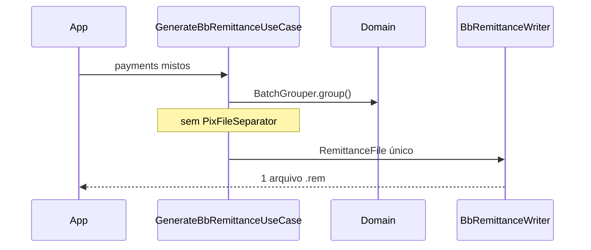

# Arquitetura DDD

## Diagrama de camadas



## Estrutura de pastas

```
src/
├── Domain/
│   ├── Shared/
│   │   ├── Enum/           PaymentMethod, SegmentType, BatchProfile...
│   │   ├── ValueObject/    TaxId, BankAccount, Money, CnabDate...
│   │   └── Exception/      InvalidBatchException, MixedPixFileException...
│   ├── Remittance/
│   │   ├── Entity/         RemittanceFile, Batch
│   │   ├── ValueObject/    PaymentDetail, BatchKey
│   │   └── Service/        BatchSegmentRules, BatchGrouper, PixFileSeparator
│   └── Return/
│       ├── Entity/         ReturnFile, ReturnBatch, ReturnDetail
│       └── ValueObject/    Occurrence, PaymentStatus
├── Application/
│   ├── Contracts/          ← planejado v2.0: writer/validator/reader interfaces
│   ├── Remittance/         GenerateRemittanceUseCase, GenerateBbRemittanceUseCase
│   ├── Return/             ParseReturnFileUseCase, ParseBbReturnUseCase
│   └── Validation/         ValidateLayoutUseCase, ValidateBbLayoutUseCase
├── Infrastructure/
│   ├── Cnab/
│   │   ├── Layout/         FieldDefinition, RecordDefinition, FieldType
│   │   ├── Serializer/     RecordFormatter
│   │   └── Parser/         RecordParser
│   ├── Bank/Itau/
│   │   ├── Layout/         FileHeaderRecord, SegmentARecord...
│   │   ├── Writer/         ItauRemittanceWriter
│   │   ├── Reader/         ItauReturnReader
│   │   └── Validator/      ItauLayoutValidator
│   ├── Bank/Bb/            ← planejado v2.0
│   │   ├── Layout/         Layouts FEBRABAN / PgtVer03BB
│   │   ├── Writer/         BbRemittanceWriter
│   │   ├── Reader/         BbReturnReader
│   │   └── Validator/      BbLayoutValidator
│   └── I18n/
│       ├── MessageCatalog.php
│       └── OccurrenceTranslator.php
└── Bank/
    ├── Itau/
    │   ├── ItauSispag.php      ← Facade Itaú
    │   └── Dto/
    └── Bb/                     ← planejado v2.0
        ├── BbPagamentos.php    ← Facade BB
        └── Dto/
```

## Domain — entidades (inglês)

### Value Objects compartilhados

| Classe | Descrição |
|---|---|
| `TaxId` | CPF/CNPJ |
| `BankAccount` | agência, conta, dac |
| `Money` | valor monetário |
| `CnabDate` | data DDMMAAAA |
| `CnabTime` | hora HHMMSS |
| `Barcode` | código de barras |
| `PixKey` | chave PIX |
| `PixKeyType` | tipo de chave (CPF, CNPJ, e-mail...) |

### Entidades de remessa

| Classe | Segmentos gerados |
|---|---|
| `PixKeyPayment` | A + B |
| `PixQrCodePayment` | J + J52Pix |
| `BankSlipPayment` | J + J52 |
| `TransferPayment` | A (+ B, C, D, E, F opcionais) |
| `UtilityPayment` | O |
| `TaxPayment` | N (+ B, W opcionais) |

### Domain Services

| Classe | Responsabilidade | Banco | Status |
|---|---|---|---|
| `BatchSegmentRules` | Valida combinações de segmentos | Itaú | ✅ |
| `ItauBatchSegmentRules` | Regras SISPAG v086 (extraído de `BatchSegmentRules`) | Itaú | ⬜ v2.0 |
| `BbBatchSegmentRules` | Regras PgtVer03BB | BB | ⬜ v2.0 |
| `BatchGrouper` | Agrupa pagamentos em lotes homogêneos | Ambos | ✅ |
| `PixFileSeparator` | Separa arquivo PIX de não-PIX | Itaú only | ✅ |
| `RecordSequencer` | Numera registros sequenciais | Ambos | ✅ |

## Application — use cases

| Use Case | Banco | Input | Output | Status |
|---|---|---|---|---|
| `GenerateRemittanceUseCase` | Itaú | CompanyDto, DebitAccountDto, PaymentDto[] | GeneratedRemittanceFile[] | ✅ |
| `GenerateBbRemittanceUseCase` | BB | CompanyDto, DebitAccountDto, PaymentDto[] | GeneratedRemittanceFile[] | ⬜ |
| `ParseReturnFileUseCase` | Itaú | string content | ReturnFile | ✅ |
| `ParseBbReturnUseCase` | BB | string content | ReturnFile | ⬜ |
| `ValidateLayoutUseCase` | Itaú | string content | ValidationResult | ✅ |
| `ValidateBbLayoutUseCase` | BB | string content | ValidationResult | ⬜ |

Contratos planejados em `Application/Contracts/`: `RemittanceWriterInterface`, `LayoutValidatorInterface`, `ReturnReaderInterface`, `RemittanceGenerationPolicy`.

## Infrastructure — motor CNAB

```php
final readonly class FieldDefinition {
    public function __construct(
        public string $name,
        public int $start,      // 1-based
        public int $length,
        public FieldType $type, // Numeric, Alpha, Decimal
        public mixed $default = null,
    ) {}
}
```

- `RecordDefinition` — coleção de fields (total = 240)
- `RecordFormatter` — array → linha de 240 chars ✅
- `RecordParser` — linha → array tipado ✅
- Encoding: UTF-8 interno, Windows-1252 na saída
- Line ending: CRLF (`\r\n`)

## Fluxo de geração — Itaú (PIX separado)



## Fluxo de geração — BB (arquivo único)



## Exceções tipadas

| Classe | Quando |
|---|---|
| `InvalidBatchException` | Lote heterogêneo, segmento proibido no perfil |
| `InvalidPaymentException` | Segmentos faltando, ordem errada, J-52/J-52 PIX incorreto |
| `MixedPixFileException` | PIX e não-PIX no mesmo arquivo (uso manual; `generateRemittance` separa automaticamente) |
| `InvalidLayoutException` | Arquivo CNAB malformado |

Todas estendem `DomainException` com `errorCode` (EN) e `getMessage()` (PT).
